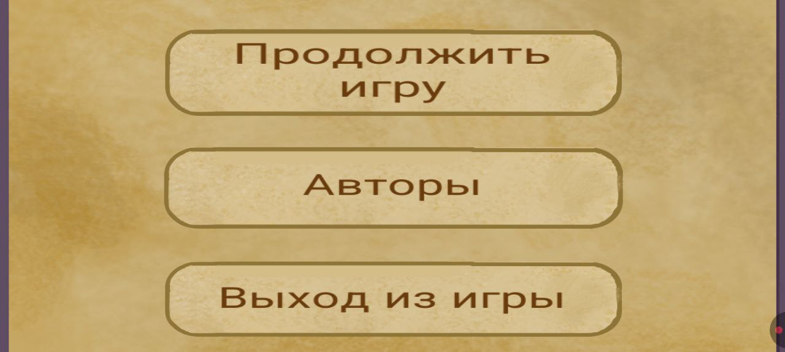
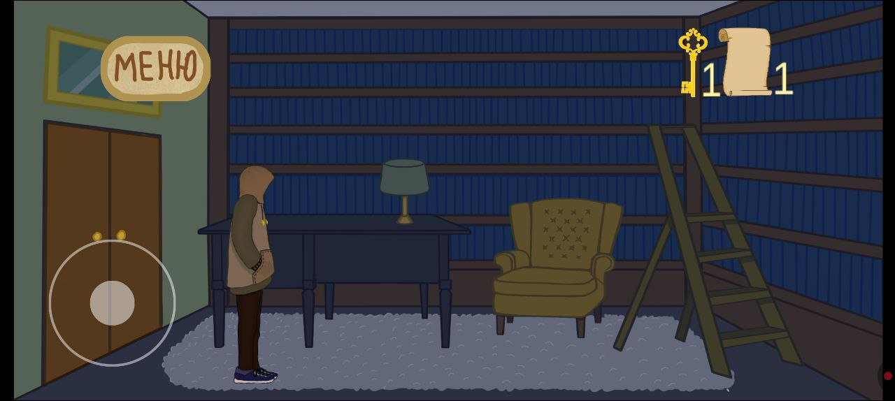
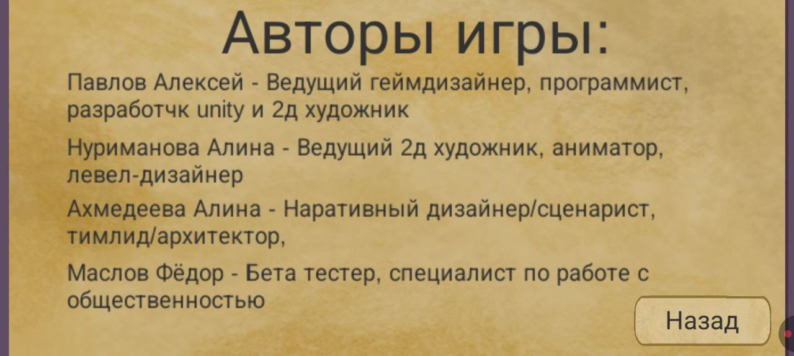
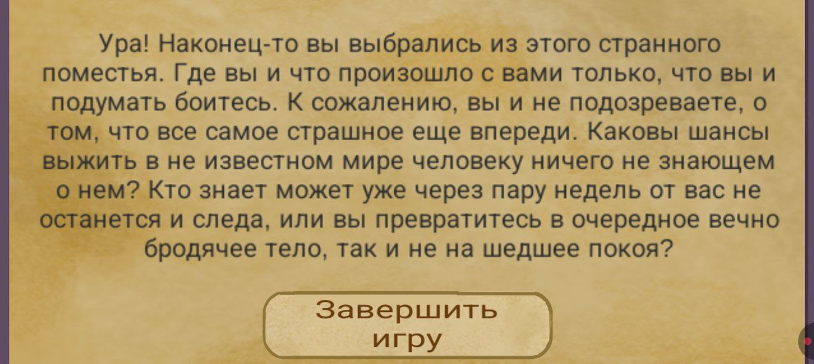
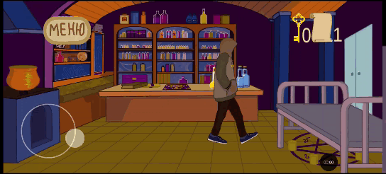

# SpookyHouse
Мобильная игра в жанре Point and click на андроид. С элементами хоррара, где игроку нужно выбраться из странного особняка в котором он оказался, праллельно разобравшись почему он тут и что произошло с поместьем. Демо делалось в команде с художницамой по окружению, сценаристом и тестеровщиком. Я делал персонажа и все, что касается программирования и unity. Игра является студенческим проктом.

# Геймплей
- Игрок просыпается на полу второго этаже поместья. Должен выбраться из него узнав важную информацию для выживания.
- Игрок может взаимодействовать с объектами в игре, что при его приближении подсвечиваются ярким светом.
- Игрок может перемещаться по локации и открыать двери.
- Есть 1 заскриптованная атака при взаимодействии с кристалом.
- В зависимости от того в какой сцене игрок встретил призрака, будут меняться монологи героя.
- Для взаимодействия с некоторыми объектами нужны специальные вещи, на пример для сундука нужен ключ.
- Если собрать все записки в игре, то это выведет на хорошую концовку

# Скриншоты и геймплей
 
 

 

 

# Запуск проекта
- В папке Build есть скомпилированная версия мобильного приложения пригодная для тестирования
